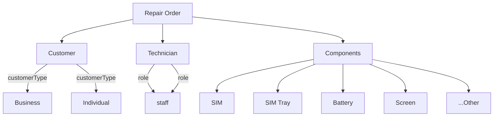

# Repair Order Module Plan

## Overview
Create a comprehensive repair order management system for mobile phone repairs with full CRUD operations, customer selection, technician assignment, and component tracking.

## Current State
- Existing Repair model with basic fields (device, model, issue, status, priority, costs)
- Existing repair controller with limited endpoints
- References User model for customer/technician (needs to change to Customer model)

## Required Fields
| Field | Type | Description |
|-------|------|-------------|
| repairId | String (auto) | Unique repair identifier (e.g., REP-001) |
| customer | ObjectId | Reference to Customer model |
| technician | ObjectId | Reference to User model (technician role) |
| model | String | Phone model |
| imei | String | Phone IMEI number |
| problem | String | Problem description |
| repairPrice | Number | Price charged to customer |
| costPrice | Number | Cost to business |
| components | Array | List of components (SIM, SIM tray, battery, etc.) |
| status | Enum | pending, in-progress, completed, cancelled |
| createdAt | Date | Creation timestamp |
| updatedAt | Date | Last update timestamp |

## Components List
Standard components:
- SIM
- SIM Tray
- Battery
- Back Panel
- Screen
- Charging Port
- Speaker
- Microphone
- Camera
- Fingerprint Sensor
- Face ID
- WiFi Antenna
- Bluetooth Antenna
- Motherboard
- Other (shows text field for custom entry)

---

## Implementation Plan

### Part 1: Backend (Database & API)

#### 1.1 Update Repair Model
- [ ] Update customer reference to Customer model
- [ ] Add IMEI field
- [ ] Rename/add repairPrice (customer pays)
- [ ] Add costPrice (business cost)
- [ ] Add components array
- [ ] Add auto-generated repairId
- [ ] Add indexes for performance

#### 1.2 Update Validation Schema
- [ ] Create repair order validation schema
- [ ] Create repair update schema
- [ ] Add component validation

#### 1.3 Update Repair Controller
- [ ] Add createRepair with full fields
- [ ] Add getRepairs with pagination, sorting, filtering
- [ ] Add getRepairById
- [ ] Add updateRepair
- [ ] Add deleteRepair (soft delete)
- [ ] Update assign technician logic
- [ ] Update complete repair logic

#### 1.4 Update Routes
- [ ] Register new routes

---

### Part 2: Frontend (UI/UX)

#### 2.1 Services
- [ ] Create repairService.js for API calls

#### 2.2 Pages
- [ ] RepairList.jsx - Table with pagination, sorting, filtering, bulk actions
- [ ] RepairCreate.jsx - Form with customer/technician dropdowns, component selection
- [ ] RepairEdit.jsx - Pre-populated form for edits
- [ ] RepairDetails.jsx - Read-only view

#### 2.3 Navigation
- [ ] Add Repairs menu item in Sidebar
- [ ] Add routes in App.jsx

---

## API Endpoints

| Method | Endpoint | Description |
|--------|----------|-------------|
| GET | /api/repairs | List all repairs (with pagination) |
| GET | /api/repairs/:id | Get single repair |
| POST | /api/repairs | Create new repair |
| PUT | /api/repairs/:id | Update repair |
| DELETE | /api/repairs/:id | Delete repair (soft) |
| PUT | /api/repairs/:id/assign | Assign technician |
| PUT | /api/repairs/:id/complete | Complete repair |

## Database Relationships
```
Repair -> Customer (many-to-one)
Repair -> User/Technician (many-to-one, role: technician)
```

## Mermaid Diagram


