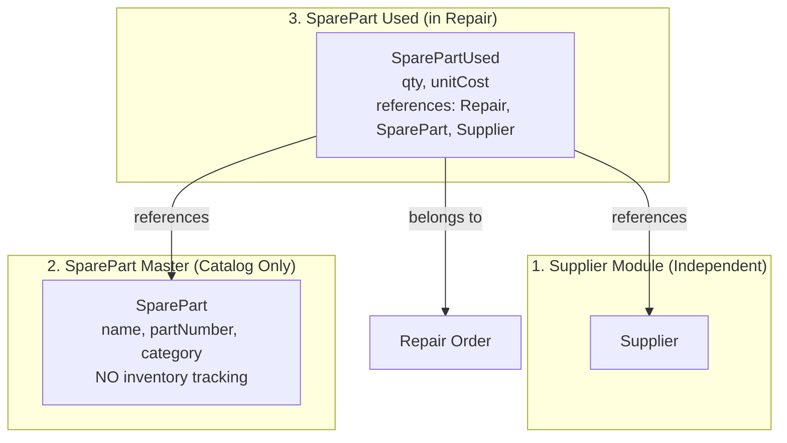
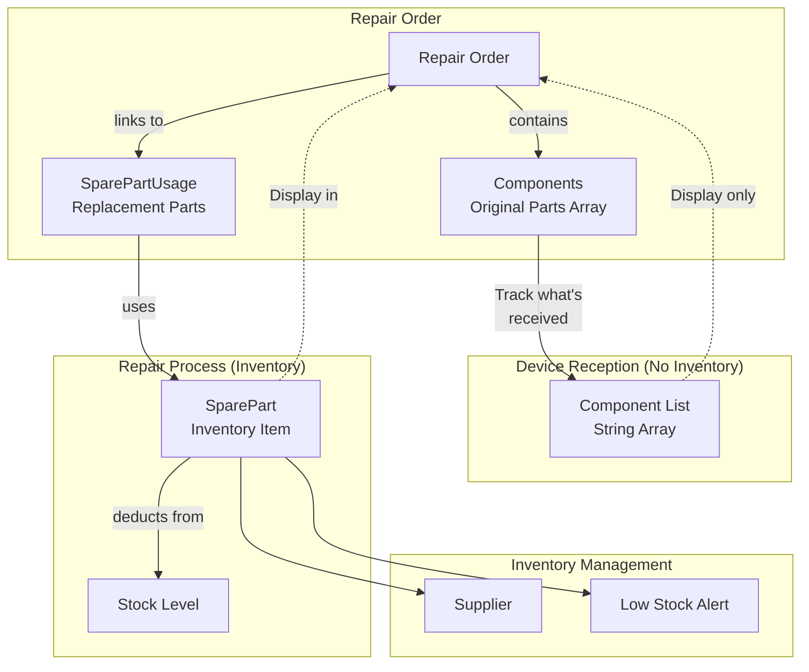
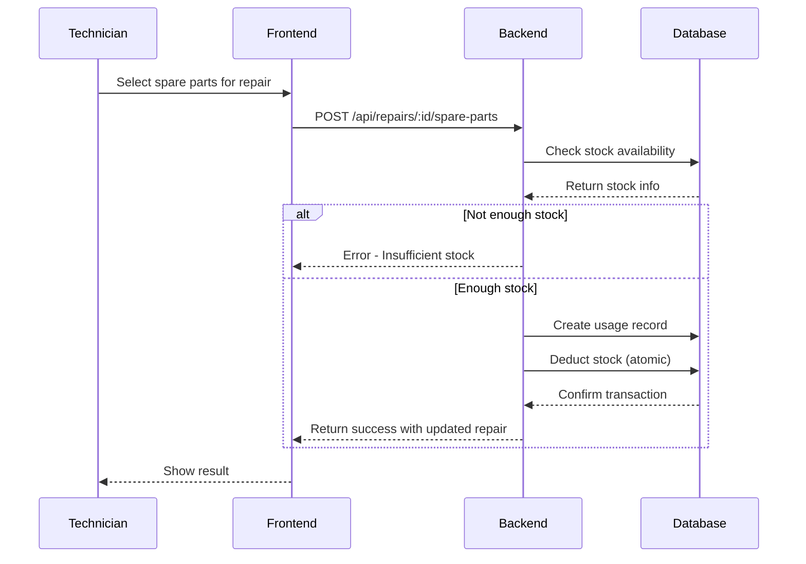

# Spare Parts Tracking Module Plan

## Overview
Simplified spare parts tracking with 3 independent modules:
1. **Supplier Module** - Manage suppliers (independent)
2. **SparePart Master** - Catalog of spare parts (no inventory tracking)
3. **SparePart Used** - Track parts used in repairs (qty, price, supplier reference)

---

## Simplified Architecture



---

## Important Distinction

### Components vs Spare Parts

**Components** (Existing - in Repair model):
- These are the **original parts** that came with the device when it was received for repair
- Purpose: **Track and ensure nothing goes missing** while the device is in for repair
- Example: Original screen, original battery, original charging port that came with the phone
- Currently tracked as string array in Repair model

**Spare Parts** (New module):
- These are the **replacement parts** installed/used during the repair
- Purpose: **Track what was replaced**, calculate costs
- Example: New screen installed, new battery replaced, new charging port added
- This is what we need to track in the new module

---

## Important Clarification: No Relationship Between Components and Spare Parts

**Components** and **Spare Parts** are **completely separate** and have **no direct relationship** in this system.

### Why They Are Separate:
- **Components** (Existing): Original parts that came with the device when received for repair
  - Purpose: Track device inventory - what was received with the device
  - Implementation: Simple string array in Repair model (unchanged)
  - Example: "Screen", "Battery" - just names, no linking to actual spare parts

- **Spare Parts** (New): Replacement parts installed/used during repair
  - Purpose: Track costs for repairs
  - Implementation: SparePart (catalog) + SparePartUsed (in repairs)
  - Example: "iPhone 13 Screen - Part #ABC123" - catalog item

### Display in Repair Details:
Both will be shown in Repair Details, but they are independent:
```
Repair Order:
├── Device: iPhone 13
├── Components (Original Parts - received with device):
│   ├── Screen
│   ├── Battery
│   └── Charging Port
│
└── Spare Parts Installed (Replacement parts used):
    ├── Screen - $120 (from inventory)
    └── Battery - $50 (from inventory)
```

---

## Current State Analysis
- Existing Repair model has `components` array for tracking device components (original parts)
- No spare parts inventory management exists
- No tracking of replacement parts used in repairs
- No stock/inventory tracking for replacement parts

---

## Requirements

### 1. Spare Parts Inventory
- Manage spare parts catalog with details (name, part number, category, price, cost)
- Track stock levels (quantity on hand, minimum stock threshold)
- Support multiple suppliers
- Track part compatibility with device models

### 2. Spare Parts Usage in Repairs
- Link spare parts to repair orders (replacement parts installed)
- Track quantity used per repair
- Calculate total parts cost per repair
- Track warranty status of parts used

### 3. Components Tracking (UNCHANGED - No relation to Spare Parts)
- Keep existing components field for original device parts (simple string array)
- NO changes to the existing Components implementation
- Components and Spare Parts have NO relationship - they are completely separate
- Components: What came with the device
- Spare Parts: What was installed during repair

---

## Proposed Data Models

### 1. SparePart Model
```javascript
{
    partNumber: String (unique),
    name: String,
    category: Enum ['screen', 'battery', 'camera', 'charging-port', 'speaker', 'microphone', 'motherboard', 'sim-tray', 'back-panel', 'other'],
    description: String,
    compatibleModels: [String],     // e.g., ["iPhone 13", "iPhone 14"]
    supplier: {
        name: String,
        supplierPartNumber: String,
        contact: String,
        email: String
    },
    pricing: {
        costPrice: Number,          // What we pay to supplier
        sellPrice: Number          // What we charge customer
    },
    inventory: {
        quantityOnHand: Number,
        minimumStock: Number,
        warehouseLocation: String
    },
    warrantyMonths: Number,         // Default warranty for this part
    isActive: Boolean,
    createdAt: Date,
    updatedAt: Date
}
```

### 2. SparePartUsage Model
// Note: SparePartUsage has NO relation to Components. They are separate.
// Components = original device parts (string array)
// SparePartUsage = replacement parts used (inventory items)
```javascript
{
    repair: {
        type: ObjectId,
        ref: 'Repair',
        required: true
    },
    sparePart: {
        type: ObjectId,
        ref: 'SparePart',
        required: true
    },
    quantity: {
        type: Number,
        default: 1,
        min: 1
    },
    unitCost: Number,               // Cost at time of usage
    totalCost: Number,              // quantity * unitCost
    warrantyStartDate: Date,
    warrantyEndDate: Date,
    installedBy: {
        type: ObjectId,
        ref: 'User'
    },
    installedAt: {
        type: Date,
        default: Date.now
    },
    notes: String
}
```

---

## Architecture Diagram



---

**Key Point**: Components and Spare Parts are **completely separate** with no database relationship. They are only displayed together in the Repair Details UI.

---

## Implementation Phases

### Phase 1: Spare Parts Catalog Management
**Goal**: Basic CRUD for spare parts inventory (the parts we use for repairs)

**Backend Tasks**:
- [ ] Create SparePart model in `apps/server/models/SparePart.js`
- [ ] Create validation schemas in `packages/validators/src/sparePart.schema.js`
- [ ] Create SparePart controller in `apps/server/controllers/sparePartController.js`
- [ ] Create routes in `apps/server/routes/sparePartRoutes.js`
- [ ] Register routes in server.js
- [ ] Add authentication middleware

**Frontend Tasks**:
- [ ] Create sparePartService.js in `apps/client/src/services/`
- [ ] Create SparePartList.jsx page
- [ ] Create SparePartCreate.jsx page
- [ ] Create SparePartEdit.jsx page
- [ ] Create SparePartDetails.jsx page
- [ ] Add navigation to sidebar
- [ ] Add routes in App.jsx

**API Endpoints**:
| Method | Endpoint | Description |
|--------|----------|-------------|
| GET | /api/spare-parts | List all spare parts (paginated) |
| GET | /api/spare-parts/:id | Get single spare part |
| POST | /api/spare-parts | Create spare part |
| PUT | /api/spare-parts/:id | Update spare part |
| DELETE | /api/spare-parts/: spare part |
|id | Delete GET | /api/spare-parts/stats | Get inventory statistics |
| GET | /api/spare-parts/low-stock | Get low stock items |

---

### Phase 2: Spare Parts Usage in Repairs
**Goal**: Track which replacement parts are installed in each repair

**Backend Tasks**:
- [ ] Create SparePartUsage model
- [ ] Create usage validation schemas
- [ ] Create SparePartUsage controller
- [ ] Add API endpoints for managing parts usage in repairs
- [ ] Implement stock deduction with transaction
- [ ] Add stock restoration when removing parts from repair
- [ ] Update Repair model to include spareParts reference

**Frontend Tasks**:
- [ ] Update RepairCreate.jsx - Add spare parts selector
- [ ] Update RepairEdit.jsx - Add spare parts selector
- [ ] Update RepairDetails.jsx - Show installed spare parts
- [ ] Create SparePartSelector component (multi-select with search)
- [ ] Show stock availability indicator

**API Endpoints**:
| Method | Endpoint | Description |
|--------|----------|-------------|
| POST | /api/repairs/:id/spare-parts | Add spare parts to repair |
| PUT | /api/repairs/:id/spare-parts/:usageId | Update spare part quantity |
| DELETE | /api/repairs/:id/spare-parts/:usageId | Remove spare part from repair |
| GET | /api/repairs/:id/spare-parts | Get all spare parts used in repair |

---

### Phase 3: Stock Management & Alerts
**Goal**: Inventory tracking and low stock warnings

**Backend Tasks**:
- [ ] Implement automatic stock deduction when parts used
- [ ] Add stock restoration when repair cancelled
- [ ] Create stock adjustment endpoint
- [ ] Add low stock detection service
- [ ] Create inventory history/tracking

**Frontend Tasks**:
- [ ] Add low stock indicators in SparePartList
- [ ] Create inventory dashboard widget
- [ ] Add stock adjustment modal
- [ ] Show stock availability in repair forms (real-time)

**API Endpoints**:
| Method | Endpoint | Description |
|--------|----------|-------------|
| POST | /api/spare-parts/:id/adjust-stock | Adjust stock quantity |
| POST | /api/spare-parts/:id/restock | Add stock (purchase) |
| GET | /api/spare-parts/:id/history | Get stock history |

---

### Phase 4: Reports & Analytics
**Goal**: Business insights and reporting

**Backend Tasks**:
- [ ] Parts usage statistics endpoint
- [ ] Cost analysis per repair
- [ ] Most used parts report
- [ ] Supplier performance tracking
- [ ] Profit margin calculations

**Frontend Tasks**:
- [ ] Spare parts usage report page
- [ ] Inventory valuation report
- [ ] Technician parts usage report

---

## Key Workflows

### Adding Spare Parts to Repair


### Components vs Spare Parts Display
// These are COMPLETELY SEPARATE - no relationship
// Both displayed in Repair Details, but independent
```
Repair Order:
├── Device: iPhone 13
├── Components (Original Parts - received with device):
│   ├── Screen
│   ├── Battery
│   └── Charging Port
│
└── Spare Parts Installed (Replacement parts - from inventory):
    ├── Screen - $120 (New)
    └── Battery - $50 (New)
```

**Note**: There is no link between "Screen" in Components and "Screen" in Spare Parts. They are independent concepts.

---

## Simplified Implementation Phases

### Phase 1: Supplier Module (Independent)
**Goal**: Manage suppliers - completely independent module

**Data Model - Supplier**:
```javascript
{
    name: String (required),
    contactPerson: String,
    phone: String,
    email: String,
    address: String,
    notes: String,
    isActive: Boolean
}
```

**Backend Tasks**:
- [ ] Create Supplier model
- [ ] Create Supplier controller with CRUD
- [ ] Create routes

**Frontend Tasks**:
- [ ] SupplierList page
- [ ] SupplierCreate/Edit page
- [ ] SupplierDetails page
- [ ] Add to navigation

---

### Phase 2: SparePart Master (Catalog Only - No Inventory)
**Goal**: Simple spare parts catalog without inventory tracking

**Data Model - SparePart**:
```javascript
{
    partNumber: String (unique),
    name: String (required),
    category: Enum,
    description: String,
    compatibleModels: [String],
    defaultCostPrice: Number,
    defaultSellPrice: Number,
    isActive: Boolean
}
```

**Backend Tasks**:
- [ ] Create simplified SparePart model (remove inventory fields)
- [ ] Create controller with CRUD
- [ ] Create routes

**Frontend Tasks**:
- [ ] SparePartList page
- [ ] SparePartCreate/Edit page
- [ ] SparePartDetails page
- [ ] Add to navigation

---

### Phase 3: SparePart Used in Repairs
**Goal**: Track which spare parts were used in each repair

**Data Model - SparePartUsed**:
```javascript
{
    repair: ObjectId (ref: 'Repair'),
    sparePart: ObjectId (ref: 'SparePart'),
    supplier: ObjectId (ref: 'Supplier'),  // Who supplied this part
    quantity: Number,
    unitCost: Number,    // Cost at time of purchase/usage
    totalCost: Number,   // quantity * unitCost
    notes: String,
    usedAt: Date
}
```

**Backend Tasks**:
- [ ] Create SparePartUsed model
- [ ] Create controller for managing parts in repairs
- [ ] Add routes: /api/repairs/:id/spare-parts
- [ ] Update Repair model if needed

**Frontend Tasks**:
- [ ] Update RepairDetails to show spare parts used
- [ ] Add spare part selector to add parts to repair
- [ ] Show supplier reference

---

## Deliverables Summary

| Phase | Description | Backend | Frontend |
|-------|-------------|---------|----------|
| Phase 1 | Supplier Module | 1 model, CRUD | 3 pages |
| Phase 2 | SparePart Master | 1 model, CRUD | 3 pages |
| Phase 3 | SparePart Used | 1 model, 4 endpoints | 2 components |

---

## Important Notes

1. **No Inventory**: SparePart Master does NOT track stock/inventory
2. **Supplier is Independent**: Supplier module exists on its own
3. **SparePartUsed links to Supplier**: When adding parts to repair, select which supplier the part came from
4. **Price set at time of use**: Unit cost is captured when the part is used in repair

---

## Deliverables Summary

| Phase | Backend | Frontend | Duration |
|-------|---------|----------|----------|
| Phase 1 | 1 model, 6 endpoints | 4 pages | ~3 days |
| Phase 2 | 1 model, 4 endpoints | 3 pages + component | ~3 days |
| Phase 3 | 3 endpoints | Updates + widget | ~2 days |
| Phase 4 | 5 endpoints | 3 pages | ~2 days |
